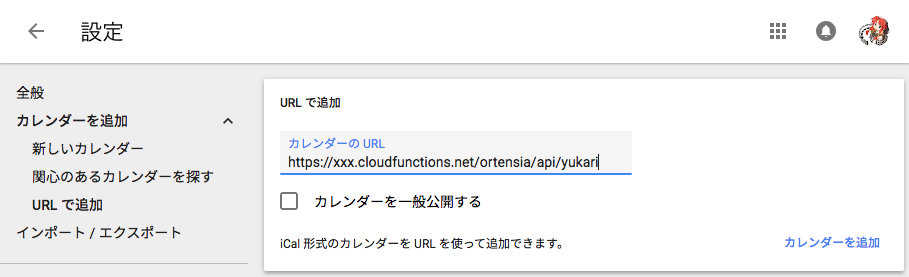

# ortensia

management media release calendar


## Usage

Deploy to CloudFunction and AppEngine

Add another calendar from url! ex) GoogleCalendar, iCalendar...




## Deploy

Put `cron/.secrets.yaml` and set following environment variables.
```
env_variables:
  HOURLY_JOB_HOST: '<url_of_your_cloud_function>'
```

```bash
# deployment cloud functions
$ npm run deploy
```

## Development

``` bash
# install dependencies
$ npm install

# serve with hot reload at localhost:3000
$ npm run dev
```
